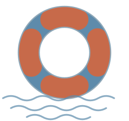

  

# Lifeboat

**A working method for keeping a one-person business running when a provider, a machine, or an account fails.**

---

Most continuity advice is a checklist. Checklists go stale, and they don't tell you *why*, so when your situation differs from the author's you have no way to reason about it.

This is organised differently:

**Threat model → Principle → Implementation**

The threat models are the things that actually go wrong. The principles are the transferable part – they hold regardless of which vendors you use. The implementations are worked examples, and they are the part most likely to be out of date.

If you read only one section, read the principles.

---

## Why this exists

I am a freelance translator. Effectively all of my income arrives through one email inbox, my client deliverables live on one machine, and my professional identity depends on domains I rent from a registrar I log into with an email address hosted by a company that has no obligation to keep serving me.

That is a normal setup for a small business. It is also a set of single points of failure that most people never map, because nothing has broken yet.

This repository is my attempt to map them properly, fix them in a defensible order, and write down the reasoning so it survives contact with the next unfamiliar situation.

It is public because the principles are worth sharing and because clients trusting me with confidential material are entitled to know how seriously I take this. My own configuration is not published, for reasons the [threat models](threats/) make obvious.

---

## The principles

| | Principle | One line |
|---|---|---|
| 1 | [No circular dependencies](principles/01-circular-dependencies.md) | The key to the box must not be inside the box |
| 2 | [A single point of failure needs a paper floor](principles/02-paper-floor.md) | Consolidation is fine if something underneath it doesn't depend on it |
| 3 | [Least privilege, everywhere](principles/03-least-privilege.md) | Every process gets the narrowest access that lets it do its job |
| 4 | [Sync is not backup](principles/04-sync-is-not-backup.md) | A mirror faithfully reproduces your mistakes |
| 5 | [Own the address, rent the mailbox](principles/05-own-the-address.md) | Portability beats loyalty |
| 6 | [An unrehearsed plan is an intention](principles/06-rehearse.md) | If you have never restored it, you do not have it |

---

## The threat models

| Threat | What actually fails |
|---|---|
| [Identity provider lockout](threats/identity-provider-lockout.md) | Email, documents, calendar, and every account that used it for recovery |
| [Registrar or DNS failure](threats/registrar-failure.md) | Your address, permanently, if a domain lapses |
| [Machine loss](threats/machine-loss.md) | Fire, theft, drive failure, spilled coffee |
| [Ransomware and credential theft](threats/ransomware-and-stealers.md) | Working files, and quietly, every password in your browser |
| [Local AI agent overreach](threats/agent-overreach.md) | Confidential client material, read by something you invited in |
| [Vendor withdrawal](threats/vendor-withdrawal.md) | A tool you depend on becomes unavailable in your country |

---

## How to use this

Do not start by buying things.

1. **Map what you have.** Which address is on file at every account that matters. This is tedious and it is the whole job – you cannot reason about dependencies you haven't listed.
2. **Find the loops.** Anywhere recovery for A runs through B and recovery for B runs through A.
3. **Break the loops first.** Nothing else you do matters until the recovery path works.
4. **Then build depth.** Offsite copies, hardware keys, local archives.
5. **Then rehearse.** On a quiet weekend, not during an outage.

The order matters more than the tooling. A perfect backup regime behind a circular dependency protects nothing.

---

## Status

This is maintained, not finished. Commit history is the changelog.

## Licence

[CC BY 4.0](LICENCE). Use it, adapt it, no need to ask.
