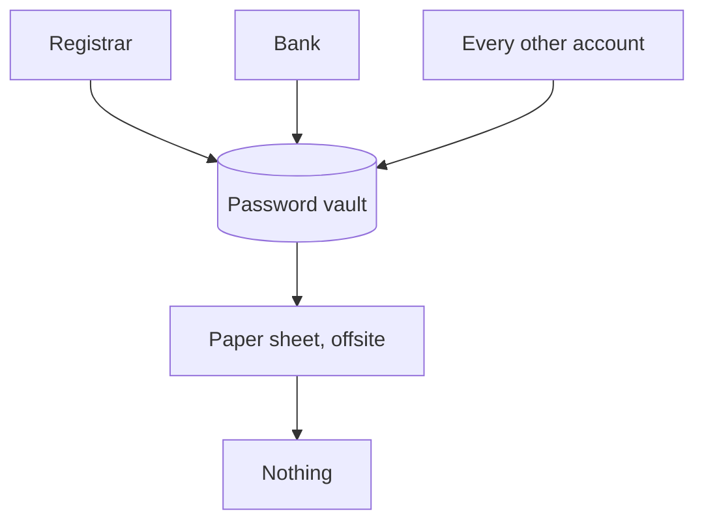

# 2. A single point of failure needs a paper floor

**Consolidation is fine, as long as something underneath it doesn't depend on it.**

## The apparent contradiction

Good practice says: eliminate single points of failure. Good practice also says: put all your credentials in one password manager.

The second appears to violate the first. It doesn't, and understanding why is the difference between a design that works and a pile of anxious half-measures.

## Concentration is usually correct

Scattering credentials across a browser, two authenticator apps, a notes file and your memory feels safer, because no single loss takes everything. In practice it is worse:

- You cannot audit what you have.
- You cannot rotate anything reliably.
- Recovery requires remembering which store held what, under stress.
- Each store has its own weaknesses, and you now own all of them.

A single well-chosen vault is easier to protect, easier to reason about, and easier to keep current. The concentration is a feature.

## But it must not be the bottom

The trade is only sound if there is a layer beneath it that does not depend on it.

That layer is **paper**. Physical, offline, immune to lockouts, outages, dead devices and forgotten master passwords – provided it isn't in the house that burned down.

What belongs on it:

- The password manager's own recovery material: emergency kit, secret key, backup codes. These *cannot* live in the vault; that would be circular.
- Backup codes for the handful of accounts needed **during** a recovery: recovery mailbox, registrar, identity provider.
- Hardware key PINs, which are not recoverable.

What does not belong on it: everything else. If the sheet is long you will not keep it current, and a stale recovery sheet is worse than none, because you will trust it.

## Loop vs. concentration

Different failure modes, and the distinction matters:

- **A dependency loop** has no exit. No preparation helps, because every path back is inside the thing you lost.
- **A single point of failure with a floor** has an exit. Losing it is disruptive, and then you use the floor.

The first is a design error. The second is a deliberate trade, and a reasonable one.

Storing a service's recovery codes inside your password manager is *not* a loop – the password manager never needs that service. It is a concentration, and the paper copy is what makes it acceptable.

## The uncomfortable part

Paper feels primitive next to hardware keys and zero-knowledge encryption. That is exactly why it works. It has no firmware, no account, no expiry and no vendor.
