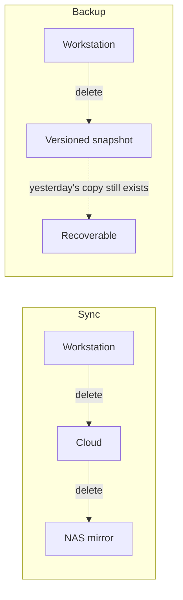

# 4. Sync is not backup

**A mirror faithfully reproduces your mistakes.**

## The difference

Sync keeps two locations identical. Backup keeps old versions.

That is the entire distinction, and it decides whether your copies survive the failures that actually happen.

Sync protects against: hardware failure, device loss, theft.

Sync does not protect against: accidental deletion, a misfiring filter, file corruption, or ransomware. In all four, the damage propagates to every synced copy on the next run, usually within seconds.

"It's on my NAS as well" is only reassuring if the NAS keeps versions.

## RAID is not backup either

RAID survives a failed disk. It does nothing about deletion, corruption, ransomware, or someone carrying the unit out of your house. Redundancy is not history.

## What a real arrangement looks like

Three copies, two kinds of media, one offsite – but the emphasis belongs on **offsite**, which is the part people skip.

A workstation and a NAS in the same building share a postcode, a mains supply, a front door and a roof. One fire, flood, surge or burglary takes both. If your only offsite copy is a cloud provider you are also trying to become independent of, then the two disasters are not independent: losing that provider silently removes your protection against the worse one.

Options that work:

- **Push offsite from the backup device**, not from the workstation. It already aggregates everything worth keeping, and it inherits the discipline you already have.
- **A rotating external drive** kept somewhere else entirely. No subscription, genuinely air-gapped, immune to anything online.
- Ideally both. One for currency, one for depth.

## Encryption is not optional

Anything leaving your premises should be encrypted with a key you hold. If you handle confidential client material, this is a contractual matter, not a preference. Decide it before the first upload, not after.

## Snapshot retention

Ransomware you notice within a day. Silent corruption in a rarely-opened archive you might not notice for a year. Retention depth is what covers the slow failures, and it is usually set to the default and forgotten.
