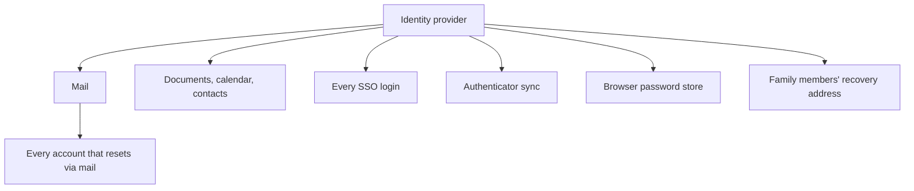

# Identity provider lockout

**You cannot sign in to the account that holds your email.**

## Causes

Automated suspension for a policy violation you did not commit. A compromise, real or suspected. A billing failure. A hijack. Occasionally, no stated reason at all — with support that is largely automated.

The specific cause matters less than the shape: it is sudden, it is usually not negotiable in the short term, and appeals take days to weeks.

## What it takes

More than mail:

- Every account that used the address for password recovery
- Every account using that provider for single sign-on — these fail instantly, with no reset path
- Documents, calendar, contacts
- The authenticator app, if it syncs to that provider
- The browser password store, if it syncs to that provider
- Any account where you are someone *else's* recovery address

The compounding is the danger. Losing mail is survivable. Losing mail, passwords and second factors simultaneously is not, unless you prepared.

## What makes it survivable

**Own the domain.** Then the address is yours and the provider is replaceable. Repointing MX is minutes; nobody needs to be told your address changed.

**A recovery identity elsewhere** ([principle 1](../principles/01-circular-dependencies.md)), so the fix is reachable.

**Credentials and second factors outside that provider** ([principle 2](../principles/02-paper-floor.md)).

**A local archive** of mail and contacts. DNS restores delivery; it does not restore history.

**A warm standby** rather than a cold one. A pre-configured account at a second provider, verified and receiving a forwarded copy, turns a two-day migration into a ten-minute DNS change.

## The residual gap

Mail sent between the failure and your switch will queue on senders' servers — most retry for a day or three — or hard-bounce. A same-morning switch recovers nearly all of it. A three-day switch does not.

That gap is the argument for rehearsal ([principle 6](../principles/06-rehearse.md)).

## The uncomfortable question

If you have already been locked out once and recovered, that is not reassurance. It is a near miss, and near misses are the only warning this failure gives.
